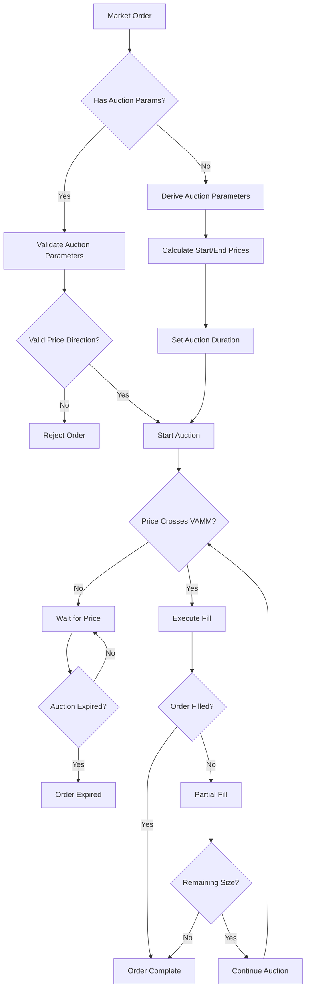

# DLOB mental model

oracle order vs limit with oracle offset:
- default expiry is 0 for limit vs. 30s for oracle & market
- oracle and market will always fill as taker. limit can use PostOnly to force being the maker i.e for rebate

LIMIT ORDERS ONLY:
- IOC: order must be filled with place_and_make or place_and_take, does not go to auction
- IOC+PO: place_and_make ix only
- max_ts: 0 never expires
- two post only orders cannot cross

IOC and PO are invalid for market and oracle orders

auctions:
- market order
- oracle offset order
- limit order with oracle_offset_price

market order:
- auction ✅
- price: fixed start/end
- final fill attempt at auction end price
- expires at timestamp or auction slot end

oracle order:
- auction ✅
- price: relative to oracle start/end
- final fill attempt at oracle auction end price
- expires at timestamp or auction slot end

limit orders: resting or floating
- A) immediately resting: post_only = true
- B) immediate auction: post_only = false, IOC implies must be used in PAT or PAM
    - Bi) upon expiration, order becomes resting order with fixed price or at oracle offset price 
- C) 

trigger: will become one of the above

## Generalizations
- any orders could cross

**auctions**
- TYPE: market,order,limit(post_only=False)
- LIST: auctions
- FILL: taker
- changes price in every slot (linear step in absolute price terms or offset price)
- expires max_ts or auction_duration
    - Oracle/Market: order cancelled/unfillable
    - Limit order: becomes resting limit order

**resting limit order**
- For resting limit orders, the maker must be older than the taker (unless it's a JIT maker)
- LIST: resting
- FILL: maker
- types: limit
- maker order (post_only=True)
- expires if max_ts > 0

**floating limit order**
- LIST: resting
- types: limit
- fill: maker
- maker order (post_only=True)
- expires if max_ts > 0
- updates every slot

- limits orders and taking orders
- both types can expire
- taking orders can be frontrun/jit filled
- both can expire

**floating taking limit order**
- LIST: auctions
- types: limit
- post_only=false
- expires if max_ts > 0
- updates every slot

**taking limit order**
- types: limit
- LIST: auctions
- maker order (post_only=False)
- expires if max_ts > 0

**trigger orders**
- check on every slot/price change
- insert into auctions or resting

**promotion**

## Market Orders



## Limit Orders

```mermaid

flowchart TD
    A[Limit Order] --> B{Post Only?}
    B -->|Yes| C[Resting Order]
    B -->|No| D{Has Oracle Price Offset?}
    
    D -->|Yes| E{Has Auction Duration?}
    D -->|No| F{Has Price?}
    
    F -->|No| C
    F -->|Yes| G{Crosses VAMM?}
    
    G -->|No| C
    G -->|Yes| H[Set Auction Parameters]
    
    E -->|No| I{Crosses VAMM?}
    E -->|Yes| J[Use Existing Auction]
    
    I -->|No| C
    I -->|Yes| H
    
    H --> K[Set Auction Start Price]
    K --> L[Set Auction End Price]
    L --> M[Calculate Auction Duration]
    
    J --> N[Validate Price Direction]
    N -->|Valid| O[Keep Auction]
    N -->|Invalid| C
  ```


## Trigger Orders
```mermaid

flowchart TD
    A[Trigger Order] --> B{Order Type?}
    B -->|Trigger Market| C[Validate Market Order]
    B -->|Trigger Limit| D[Validate Limit Order]
    
    C --> E{Has Valid Trigger?}
    D --> E
    
    E -->|No| F[Reject Order]
    E -->|Yes| G{Trigger Condition?}
    
    G -->|Above| H[Wait for Price > Trigger]
    G -->|Below| I[Wait for Price < Trigger]
    
    H --> J{Price Crosses Trigger?}
    I --> J
    
    J -->|No| K[Keep Waiting]
    J -->|Yes| L[Trigger Order]
    
    L --> M{Order Type?}
    M -->|Trigger Market| N[Convert to Market Order]
    M -->|Trigger Limit| O[Convert to Limit Order]
    
    N --> P[Set Auction Parameters]
    O --> Q[Set Auction Parameters]
    
    P --> R[Execute Auction]
    Q --> R
    
    R --> S{Order Filled?}
    S -->|Yes| T[Order Complete]
    S -->|No| U[Order Expired]
```


# TODO:
- [x] oracle and market order get_price must use calculate_auction_price
- [x] DLOB builder to sync orderbooks at startup
- [x] DLOB should have some way to partition by markets

- [ ] add trigger orders
    - a bot must call the `trigger_order` ix
    - trigger + fill opportunity: big for real users
